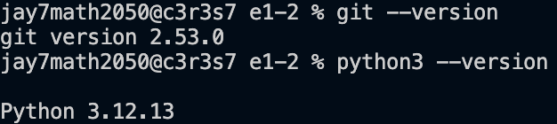
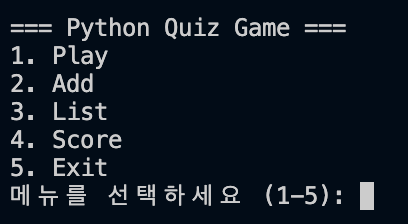
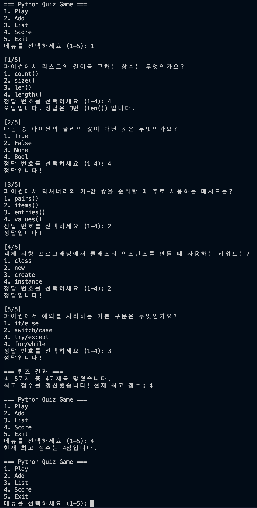
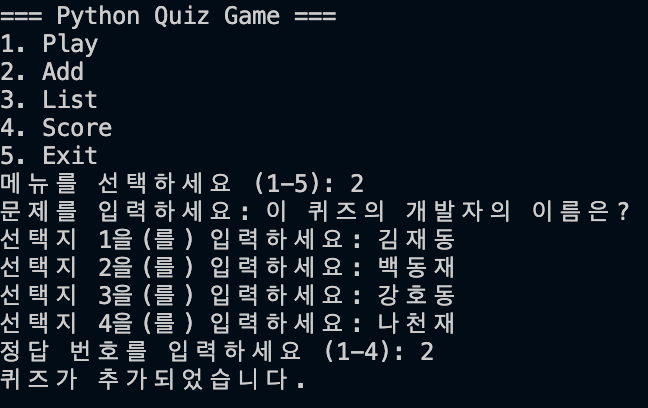
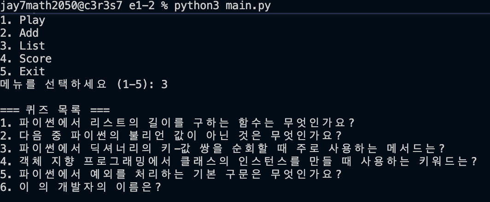
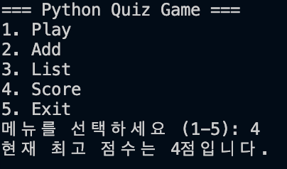
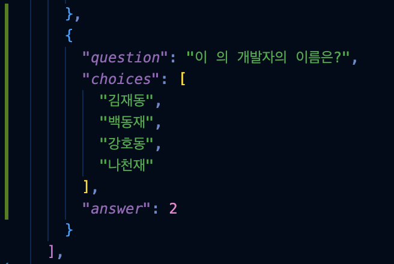
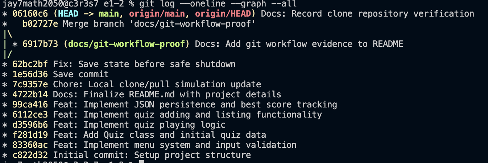

# Python Quiz Game

## 1. 프로젝트 개요

이 프로젝트는 Python으로 만든 터미널 기반 퀴즈 게임입니다. 사용자는 메뉴에서 번호를 선택해 퀴즈를 풀고, 새 퀴즈를 추가하고, 저장된 퀴즈 목록과 최고 점수를 확인할 수 있습니다. 프로그램 상태는 프로젝트 루트의 `state.json`에 저장되므로, 프로그램을 종료한 뒤 다시 실행해도 추가한 퀴즈와 최고 점수가 유지됩니다.

---

## 2. 실행 환경

```bash
$ pwd
/Users/jay7math2050/Desktop/workspace/e1-2

$ python3 --version
Python 3.12.13

$ git --version
git version 2.53.0
```

설명:

- 이 과제는 Python 3.10 이상 기준으로 작성했습니다.
- 외부 라이브러리 없이 표준 라이브러리(`json`)만 사용했습니다.
- Git으로 커밋, 브랜치, merge, clone, pull 흐름까지 함께 관리했습니다.

---

## 3. 실행 방법

```bash
$ cd /Users/jay7math2050/Desktop/workspace/e1-2
$ python3 main.py
```

프로그램을 실행하면 아래와 같은 메뉴가 표시됩니다.

```text
=== Python Quiz Game ===
1. Play
2. Add
3. List
4. Score
5. Exit
```

---

## 4. 기능 목록

이 프로그램은 아래 기능을 제공합니다.

1. **퀴즈 풀기**
   - 저장된 퀴즈를 순서대로 출제합니다.
   - 정답/오답을 바로 알려줍니다.
   - 모든 문제를 풀면 총 점수를 보여줍니다.

2. **퀴즈 추가**
   - 문제, 선택지 4개, 정답 번호를 입력받아 새 퀴즈를 등록합니다.
   - 등록한 퀴즈는 `state.json`에 바로 저장됩니다.

3. **퀴즈 목록 확인**
   - 현재 저장된 퀴즈의 문제 문장을 목록으로 출력합니다.

4. **최고 점수 확인**
   - 지금까지 기록된 최고 점수를 출력합니다.

5. **데이터 영속성**
   - 퀴즈 목록과 최고 점수를 `state.json`에 저장하고 다시 불러옵니다.

---

## 5. 프로그램 구조

파일 구조:

```text
e1-2/
├── main.py
├── state.json
├── README.md
├── .gitignore
└── docs/
    └── screenshots/
```

파일 설명:

- `main.py`: 게임 실행 파일이며 메뉴, 입력 검증, 퀴즈 진행, 저장/불러오기 로직을 포함합니다.
- `state.json`: 퀴즈 데이터와 최고 점수를 저장하는 파일입니다.
- `README.md`: 프로젝트 설명, 실행 방법, 인터뷰형 답변, 제출 증빙 가이드를 정리한 문서입니다.
- `docs/screenshots/`: 제출용 스크린샷을 저장할 폴더입니다.

---

## 6. 클래스와 역할 분리

### `Quiz`

- 퀴즈 한 문제를 표현하는 클래스입니다.
- `question`, `choices`, `answer`를 속성으로 가집니다.
- 선택지가 4개인지, 정답 번호가 1~4인지 생성 시점에 검증합니다.
- 문제와 선택지를 출력하는 `display()` 메서드를 가집니다.

### `QuizGame`

- 게임 전체 흐름을 관리하는 클래스입니다.
- 퀴즈 목록, 최고 점수, 저장 파일 경로를 관리합니다.
- 메뉴 출력, 퀴즈 풀기, 퀴즈 추가, 목록 보기, 최고 점수 확인, 파일 저장/불러오기를 담당합니다.

정리하면, `Quiz`는 **문제 1개**, `QuizGame`은 **게임 전체 진행**을 맡도록 책임을 나눴습니다.

---

## 7. 입력 처리와 예외 처리

숫자 입력이 필요한 부분은 `get_safe_int_input()` 메서드에서 공통 처리합니다.

처리 기준:

- 입력 앞뒤 공백 제거
- 빈 입력 방지
- 숫자 변환 실패 처리
- 허용 범위 밖 숫자 처리
- 재입력 유도

예를 들어 아래 입력들을 처리할 수 있습니다.

```text
abc
9

0
```

또한 `KeyboardInterrupt` (`Ctrl+C`) 와 `EOFError` 가 발생하면 프로그램이 비정상 종료되지 않도록 저장 후 안전하게 종료하도록 구성했습니다.

---

## 8. 데이터 저장과 불러오기

이 프로젝트는 프로젝트 루트의 `state.json` 파일을 사용합니다.

현재 데이터 구조:

```json
{
  "quizzes": [
    {
      "question": "문제 문자열",
      "choices": ["선택지1", "선택지2", "선택지3", "선택지4"],
      "answer": 1
    }
  ],
  "best_score": 0
}
```

필드 설명:

- `quizzes`: 퀴즈 객체 목록
- `question`: 문제 문장
- `choices`: 4개의 선택지 배열
- `answer`: 정답 번호(1~4)
- `best_score`: 최고 점수

저장/불러오기 흐름:

1. 프로그램 시작 시 `QuizGame.__init__()` 에서 `load_data()`를 호출합니다.
2. `state.json`이 정상적이면 저장된 퀴즈와 최고 점수를 읽어옵니다.
3. 파일이 없거나 JSON이 손상되었으면 기본 퀴즈 데이터로 복구합니다.
4. 퀴즈 추가 또는 최고 점수 갱신 시 `save_data_safely()`를 통해 다시 저장합니다.
5. 안전 종료 상황에서도 저장을 한 번 더 시도합니다.

---

## 9. 기본 퀴즈 데이터

기본 퀴즈는 Python 주제로 5개를 포함하고 있습니다.

예시 주제:

- 리스트 길이 함수
- 불리언 값 구분
- 딕셔너리 순회 메서드
- 클래스 인스턴스 생성 키워드
- 예외 처리 구문

`state.json`과 `main.py` 기본 데이터 모두에서 5개 이상의 퀴즈를 확인할 수 있습니다.

---

## 10. Git 작업 기록

이 과제는 기능 단위로 커밋을 나누어 작업했습니다.

예시 커밋 흐름:

- 초기 구조 생성
- 메뉴 및 입력 검증 구현
- `Quiz` 클래스와 기본 퀴즈 추가
- 퀴즈 풀기 기능 구현
- 퀴즈 추가 / 목록 기능 구현
- JSON 저장 및 최고 점수 구현
- README 정리
- 안전 종료 저장 처리 보완
- 브랜치 작업 후 merge
- clone / pull 검증용 커밋 반영

커밋 메시지 규칙:

- `feat:` 새 기능 추가
- `fix:` 동작 수정 또는 예외 처리 보완
- `docs:` 문서 보강
- `chore:` 실습 기록이나 보조 작업 정리

또한 별도 브랜치를 생성해 작업한 뒤 `main` 브랜치로 병합했고, 저장소를 별도 디렉터리에 `clone`한 뒤 수정 사항을 `push`하고 원래 작업 디렉터리에서 `pull`로 다시 가져오는 흐름도 수행했습니다.

---

## 11. 부가 설명

### Q1. 왜 클래스를 사용했나요?
A. 퀴즈 한 문제를 표현하는 데이터와 게임 전체 진행 로직을 분리하기 위해서입니다. 함수만으로도 만들 수 있지만, 클래스를 사용하면 데이터와 동작을 함께 묶을 수 있어 역할이 더 분명해집니다.

### Q2. `Quiz`와 `QuizGame`의 책임은 어떻게 나눴나요?
A. `Quiz`는 문제 1개와 그 문제를 출력하는 역할만 맡고, `QuizGame`은 메뉴, 점수, 퀴즈 목록, 저장/불러오기 같은 전체 게임 흐름을 관리합니다.

### Q3. 입력 처리 / 게임 진행 / 저장 로직은 어떤 기준으로 나눴나요?
A. 여러 기능에서 반복되는 숫자 입력 검증은 `get_safe_int_input()`으로 공통화했고, 실제 게임 동작은 `play_quiz()`, `add_quiz()`, `list_quizzes()`처럼 기능별 메서드로 분리했습니다. 저장과 불러오기는 `save_data()`, `save_data_safely()`, `load_data()`로 따로 분리해 책임을 명확히 했습니다.

### Q4. `state.json` 읽기/쓰기 흐름은 어떻게 되나요?
A. 시작할 때 `load_data()`로 파일을 읽고, 퀴즈 추가나 최고 점수 갱신 시 저장합니다. 종료 중 예외가 발생해도 `save_data_safely()`를 호출해 가능한 범위에서 상태를 보존합니다.

### Q5. JSON 파일을 사용한 이유는 무엇인가요?
A. JSON은 사람이 읽기 쉽고 Python의 리스트, 딕셔너리 구조와 잘 맞아서 퀴즈 데이터 저장에 적합합니다. 작은 규모의 콘솔 프로그램에서는 별도 데이터베이스 없이도 구조를 표현하기 쉽다는 장점이 있습니다.

### Q6. 파일 입출력에서 `try/except`가 왜 필요한가요?
A. 파일이 없거나, JSON이 깨졌거나, 읽기/쓰기 중 운영체제 오류가 날 수 있기 때문입니다. `try/except`가 없으면 프로그램이 바로 종료될 수 있으므로, 예외를 잡고 기본 데이터로 복구하거나 안내 메시지를 출력해야 합니다.

### Q7. 안전 종료는 어떻게 처리했나요?
A. 입력 도중 `Ctrl+C`나 `EOF`가 발생하면 `KeyboardInterrupt`, `EOFError`를 잡아서 `save_data_safely()`를 호출한 뒤 종료합니다. 이렇게 하면 비정상 종료 대신 안내 메시지를 보여 주고 저장을 시도한 뒤 프로그램을 끝낼 수 있습니다.

### Q8. 브랜치를 분리해 작업한 이유와 merge의 의미는 무엇인가요?
A. 브랜치를 분리하면 메인 작업 흐름을 깨지 않고 기능이나 문서 수정 작업을 독립적으로 진행할 수 있습니다. merge는 분리된 작업 결과를 다시 `main` 브랜치로 합쳐 최종 결과물에 반영하는 과정입니다.

### Q9. 현재 `state.json` 구조를 이렇게 설계한 이유는 무엇인가요?
A. 퀴즈는 여러 개가 필요하므로 배열(`quizzes`)로 관리했고, 최고 점수는 하나만 필요하므로 `best_score`라는 단일 값으로 분리했습니다. 구조가 단순해서 읽고 쓰기 쉽고, 필요한 데이터만 바로 찾을 수 있습니다.

### Q10. 퀴즈가 1000개 이상으로 늘어나면 JSON 방식의 한계는 무엇인가요?
A. 파일 전체를 한 번에 읽고 다시 써야 하므로 데이터가 커질수록 비효율적일 수 있습니다. 검색, 정렬, 부분 수정이 많아지면 JSON보다 데이터베이스가 더 적합할 수 있습니다.

### Q11. `state.json` 파싱이 실패하면 어떤 대응이 가능한가요?
A. 현재는 기본 퀴즈 데이터로 복구하고 다시 저장하도록 만들었습니다. 더 안전하게 하려면 손상된 파일을 백업 파일로 남기고, 사용자에게 복구 여부를 묻는 방식도 고려할 수 있습니다.

### Q12. 요구사항이 바뀌면 어디부터 수정해야 하나요?
A. 기능 변화가 메뉴와 연결되면 `QuizGame.run()`과 관련 메서드부터 수정해야 하고, 퀴즈 데이터 구조가 바뀌면 `Quiz`, `save_data()`, `load_data()`, `state.json` 구조를 함께 수정해야 합니다. 화면 출력 형식 변경은 주로 `display_menu()`와 각 출력 메서드를 먼저 보면 됩니다.

---

## 12. 실행 및 제출 증빙

### 12-1. 개발 환경



### 12-2. 메뉴 실행 화면



### 12-3. 퀴즈 풀기 화면



### 12-4. 퀴즈 추가 화면



### 12-5. 퀴즈 목록 화면



### 12-6. 최고 점수 화면



### 12-7. 데이터 유지 확인



### 12-8. Git 로그 및 브랜치/병합 기록



---

## 13. 최종 제출 전 체크리스트

- [x] 프로그램이 실행된다.
- [x] 메뉴가 출력된다.
- [x] 퀴즈 풀기 / 추가 / 목록 / 점수 확인 기능이 동작한다.
- [x] 기본 퀴즈가 5개 이상 포함되어 있다.
- [x] `state.json`에 퀴즈와 최고 점수가 저장된다.
- [x] 클래스가 2개 이상 존재한다.
- [x] 입력 오류와 안전 종료를 처리한다.
- [x] Git 커밋이 10개 이상 존재한다.
- [x] 브랜치 생성 및 merge 기록이 있다.
- [x] clone / pull 실습 흔적이 있다.
- [x] `docs/screenshots/`에 제출용 스크린샷을 저장했다.
