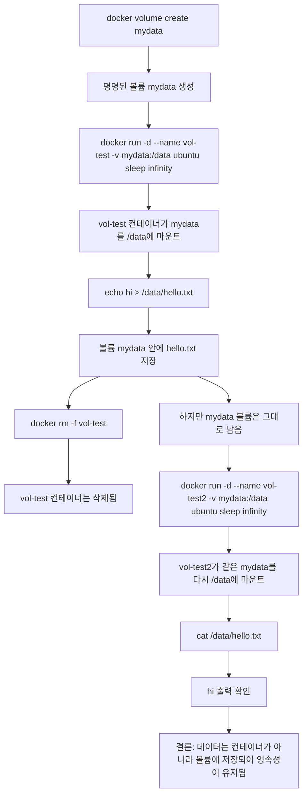

```mermaid
flowchart TD
    A["docker volume create mydata"] --> B["명명된 볼륨 mydata 생성"]
    B --> C["docker run -d --name vol-test -v mydata:/data ubuntu sleep infinity"]
    C --> D["vol-test 컨테이너가 mydata를 /data에 마운트"]
    D --> E["echo hi > /data/hello.txt"]
    E --> F["볼륨 mydata 안에 hello.txt 저장"]

    F --> G["docker rm -f vol-test"]
    G --> H["vol-test 컨테이너는 삭제됨"]
    F --> I["하지만 mydata 볼륨은 그대로 남음"]

    I --> J["docker run -d --name vol-test2 -v mydata:/data ubuntu sleep infinity"]
    J --> K["vol-test2가 같은 mydata를 다시 /data에 마운트"]
    K --> L["cat /data/hello.txt"]
    L --> M["hi 출력 확인"]
    M --> N["결론: 데이터는 컨테이너가 아니라 볼륨에 저장되어 영속성이 유지됨"]
```
